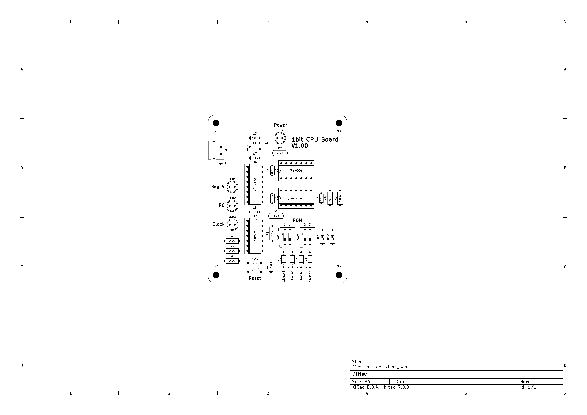
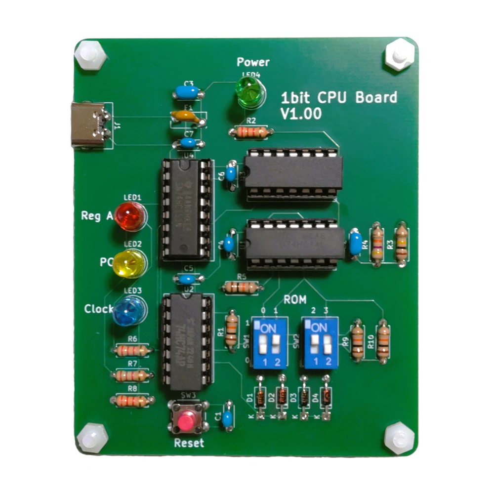

# 1bit-CPU
使用74HC系列逻辑IC的1bit CPU。

# 摘要
这是一个1bit CPU的介绍文件。
您可以使用74HC系列逻辑IC制作CPU。

# 电路图

## 实物图

## 介绍
正常的CPU通过执行指令来完成特定的算法。不同的CPU架构有不同的指令集，例如Intel CPU常用的X86指令集和手机中常用的ARM指令集。此项目是一个简单到极致的1bit-cpu，它也拥有输入设备、输出设备、运算器、存储器和控制器等复杂CPU中必备的部件。此CPU共有四条指令，指令最大长度为2，通过两个开关来编程。每个开关的位置代表一条指令。

### 开关功能
- **左侧开关**：控制MUX选择是更新寄存器A还是程序计数器PC。
- **右侧开关**：控制第二个XOR操作数或设置目标PC地址。

### 指令解释
LR
00: MUX=0, RA=RA^0=RA, PC=!PC
01: MUX=0, RA=RA^1=!RA, PC=!PC
10: MUX=1, RA=RA, PC=0
11: MUX=1, RA=RA, PC=1

### 使用简述
- OFF, OFF：将保持A的值并推进PC（0->1, 1->0）
- OFF, ON：将反转A的值（0->1, 1->0）并推进PC（0->1, 1->0）
- ON, OFF：将保持A的值并将PC设置为0
- ON, ON：将保持A的值并将PC设置为1

### 指令表
| 01 23 | 功能  | 循环C语言等效       | 描述                  |
|-------|-------|--------------------|-----------------------|
| 00 00 | NOP, NOP | void; void;       | 无操作                |
| 00 01 | NOP, INV | void; a=!a;       | 半频率闪烁            |
| 00 10 | NOP, NOP | void; void;       | 无操作                |
| 00 11 | NOP, HLT | void; while(1);   | 永久停机              |
| 01 00 | INV, NOP | a=!a; void;       | 半频率闪烁            |
| 01 01 | INV, INV | a=!a; a=!a;       | 最大频率闪烁          |
| 01 10 | INV, NOP | a=!a; void;       | 半频率闪烁            |
| 01 11 | INV, HLT | a=!a; while(1);   | 通常一次状态更改后停机|
| 10 00 | HLT, NOP | while(1); void;   | 永久停机              |
| 10 01 | HLT, INV | while(1); a=!a;   | 最多一次状态更改后停机|
| 10 10 | HLT, NOP | while(1); void;   | 永久停机              |
| 10 11 | HLT, HLT | while(1); while(1); | 永久停机            |
| 11 00 | NOP, NOP | void; void;       | 无操作                |
| 11 01 | NOP, INV | void; a=!a;       | 半频率闪烁            |
| 11 10 | NOP, NOP | void; void;       | 无操作                |
| 11 11 | NOP, HLT | void; while(1);   | 永久停机              |

## 视频
