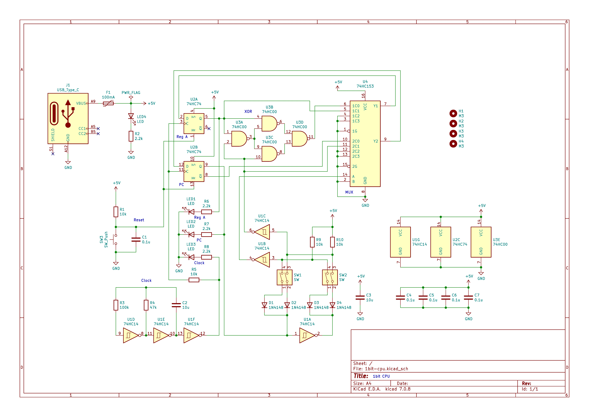

# 1bit-CPU
使用74HC系列逻辑IC的1bit CPU。

# 摘要
这是一个1bit CPU的介绍文件。
您可以使用74HC系列逻辑IC制作CPU。

# 电路图

## 电路图

## 介绍
### 开关功能
- **左侧开关**：控制MUX选择是更新寄存器A还是程序计数器PC。
- **右侧开关**：控制第二个XOR操作数或设置目标PC地址。

### 指令解释
LR
00: MUX=0, RA=RA^0=RA, PC=!PC
01: MUX=0, RA=RA^1=!RA, PC=!PC
10: MUX=1, RA=RA, PC=0
11: MUX=1, RA=RA, PC=1